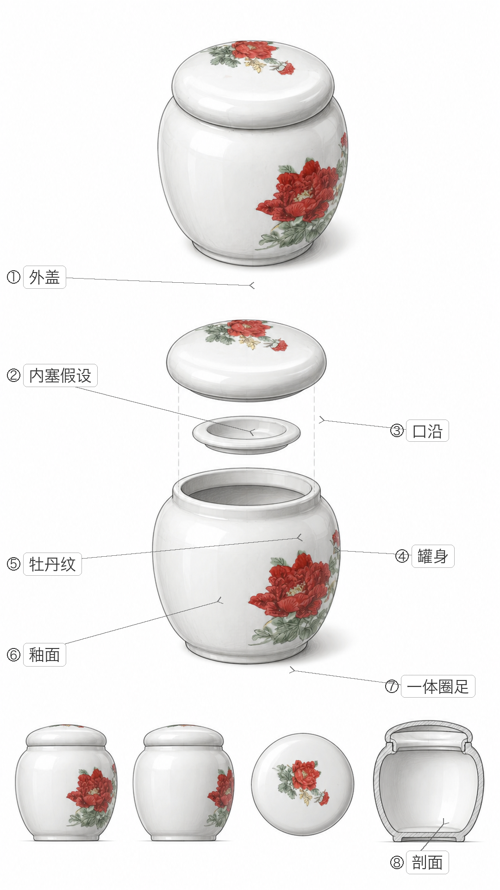

# Product Design Deconstruction

Turn product photos, screenshots, or product links into industrial-design deconstruction: visible-fact analysis, working-principle research, structure hypotheses, exploded-view planning, CMF notes, and Chinese annotated design boards.

This Codex skill is built for careful product interpretation. It separates what is visible, what the user has confirmed, what is category-based inference, and what is creative reconstruction. That makes it useful for design education, product analysis, visual research, social-media explainers, and concept-board generation.




## Why Star This

- Turns ordinary product photos into structured design-analysis material.
- Forces a visible-facts vs inferred-structure distinction before generating diagrams.
- Preserves the product's specific visual identity instead of replacing it with a generic category sample.
- Includes category-principle and structure-consistency checks for more responsible exploded views.
- Supports Chinese handwritten-style local labels after clean no-text image generation.

## When To Use

Use this skill when you want to analyze or visually explain:

- Consumer products, appliances, tools, packaging, containers, lamps, cups, stationery, toys, or restaurant objects.
- Product working principles, use paths, safety details, and serviceable parts.
- Exploded-view concepts, section-view logic, three-view boards, or CMF studies.
- Product-design learning material for students, social posts, workshops, or internal research.

## Example Outputs

The `examples/` folder contains real outputs produced with this workflow:

- `examples/hotpot-annotated-board.png`: old Beijing copper hot pot design deconstruction with Chinese labels.
- `examples/tea-canister-annotated-board.png`: tea canister structure-consistency design board.

These are representative outputs, not verified teardown evidence.

## How To Invoke

```text
$product-design-deconstruction
Analyze this product photo. Preserve its visible exterior identity, infer the likely structure conservatively, and create a 9:16 Chinese annotated design board.
```

```text
$product-design-deconstruction
Use this product link as reference. First summarize the working principle, then draft an exploded-view prompt and a Chinese component label list.
```

```text
$product-design-deconstruction
Only write the design deconstruction notes. Separate visible facts, user-provided facts, category inference, and creative reconstruction.
```

## What It Produces

- Subject and category identification.
- Visible design facts and visual-identity preservation notes.
- Working-principle model and source-aware assumptions.
- Part vs integral-feature classification.
- Exploded-view and section-view logic.
- Component contract for later image generation and labeling.
- Chinese label list and annotation placement discipline.
- Publication safety notes and AI/assumption disclaimer guidance.

## Install

Copy this folder into your Codex skills directory:

```bash
mkdir -p ~/.codex/skills
cp -R product-design-deconstruction ~/.codex/skills/
```

Then invoke it in Codex with `$product-design-deconstruction`.

## Repository Structure

- `SKILL.md`: main workflow, evidence rules, output menu, and image-delivery discipline.
- `references/category-principles.md`: category-specific product logic.
- `references/structure-consistency-cases.md`: rules for avoiding impossible exploded views.
- `scripts/add_handwritten_labels.py`: local Chinese annotation helper.
- `examples/`: representative design-board outputs from prior runs.
- `agents/openai.yaml`: Codex UI metadata.

## Customization Ideas

Fork this skill if you want to adapt it for:

- A single product category such as lamps, packaging, kitchenware, children's products, or electronics.
- A design-school teaching workflow with rubrics and classroom exercises.
- A more technical engineering teardown workflow that requires measurements, manuals, patents, or CAD evidence.
- A brand-safe social-media deconstruction format with stricter publishing rules.
- Different annotation styles, languages, or canvas formats.

The best starting points are `SKILL.md`, `references/category-principles.md`, and the label script.

## Important Boundary

This skill produces design analysis and conceptual reconstruction. It should not present hidden internal parts as verified facts unless the user provides teardown photos, manuals, CAD, patents, or measurements.
